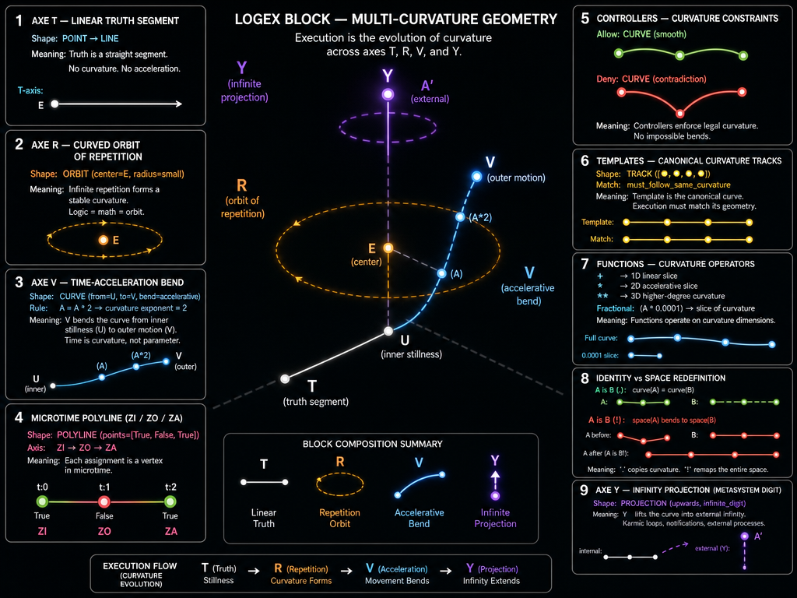
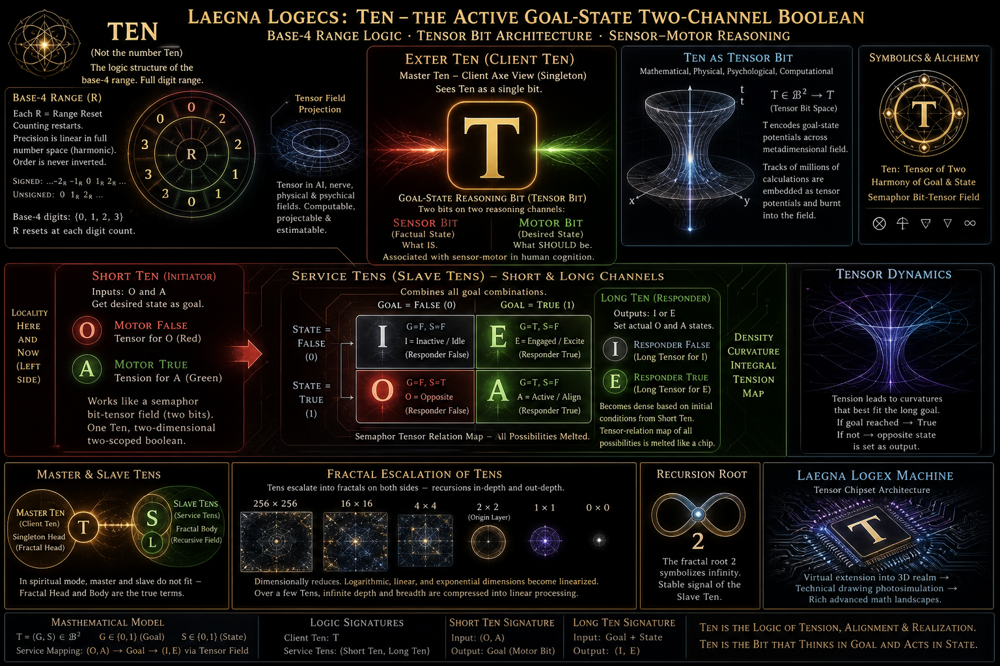
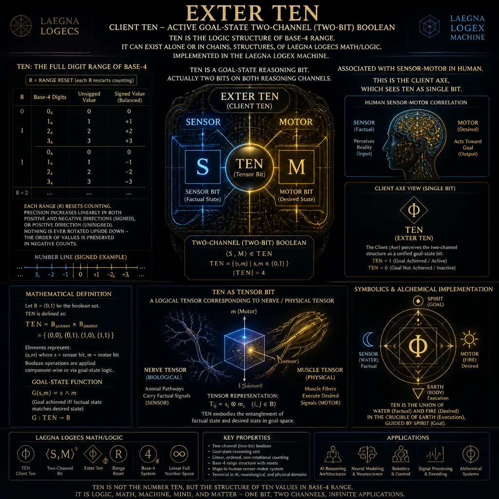

# Execution path of Logex logic block

This is the most semantic version, based on a lot of rotations on axes which are actually free - so it's essential, where I do not work with the axes which optimize very differently based on your goal - minimal code, or optimized server, or logecs supercore which automatically optimizes each query and storage and execution track, utilizing each kind of intelligence on optimal load: this can be 128kb interpreter - i.e. TinySQL, 5MB service - i.e. MySQL, or 2GB supersystem - i.e. Oracle - or it's smaller emulation like PostGreSQL. SQL is perfect example: scaling from less than one kb for already meaningful subset, which could include major commands and semantic cases - add, remove, all or any - so that you could edit a table or a dataset / database / knowledge base.

Here is execution logic:

## Value - Axe T (1D, linear-speed)

```prolog
  A = E.
```

$A = Posetion$. Logically, Posetion is a Truth Value, .

## Value State/Goal - Axe R (2D, exponential-acceleration).

```prolog
  A[E] = E.
```

Block repeats infinitely:
- If two given blocks repeat infinitely:
  - They return this value, and it's done.
  - They never conflict their past values.
  - This is ordinary logic, even if math - mathematically, that A = E yields E, logically A yields E - these are equivalent, R=1, T=E, logical and mathematical logecs values and on both, every operation could be used: something like R(E: E) could turn this R-T pair dict into normal number, and compress it's digits.
    - These representations should mirror and allow conversions perfectly, altough logician and mathematician could typically need different ones:
      - For mathematician, that their animation runs perfectly reflecting the shapes and their transforms, is itself Truth: they might not judge it.
      - For logician, the system interacts with reality through "Statements", and it prefers the Statements which are true: `not A` is true if A is not, so if made a statement, logic system always seeks how to make it true: by what assistance and results it provides, not that it would separate goals and states.

That A is E gives E. $A = E$. Mathematically, E is a number, and that A is E yields True. That A is E: Logically, $A.$ gives that `A is E` - it's the desired value.

## Value Transistion: Real acceleration



```prolog
  if not exists A:
    A = True.
  A = A * 2.
```

Value of this block has T value with origin U, inner zero:
- Inner block

Value of this block has R value at V, exter zero:
- Variable A * 2 => True = A;
  - Acceleration of A is exponent 2: V connects end with beginning, and calculates the point-acceleration using external coordinate system.
  - On external coordinate system, A = A * 2 with inner depth limit True, which is the origin point (Zero) of the projection - calculation starts at Zero from True, and V counts time, the accelerative quality to turn idealistic static still into moment of movement with it's yin (inside block) and yang (projecting outside block).
  - V could be associated with outer and inner block V's, which can be symmetric and always projecting to the right point, and V passes time upwards.

## Value following logic

Values are followed in imperative-like order:

```prolog
  A = True.
  A = False.
  A = True.
```

This order is perfect:
- Value of A at V, as seen out-scope, is True.
- A can still change it's value according that while implication time passes, t = t + 1, and three A's are actually \[t = 0\]A, \[t = 1\]A, \[t = 2\]A, which can have different values because when we set A to some value, it's microtime is updated: ZI, ZO, ZA are three time moments in Laegna language: microscale / log Z, 1I, 2A, 3O.
  - If A is constant, it's illogical to change it's value.

## Controllers

A function is controller of other function if:

It creates controller slave classes, which:
- Does it's operations and logic in parallel to controller.
- Calls the controller functions.

It creates controller master class(es), which:
- Is controller itself.
- Checks constraints:
  - In opengl, with controller, syntax order such as begin lines => draw line => draw line => end lines is checked, that draw line is allowed in this order, and end must close the begin etc.

In controller:
- Each slave gets it's own class of variables from each master, and both can be zero, one or more.
- Variable states must not run into contradiction:
  - If time = 100 is set by any, none must contradict.
  - If controller allows to calculate value only in certain order, controllers must agree to this logic.

Instead of following syntaxtic simplification, like turning Goto necessarily to While, If, Function and Switch, we follow meaningful simplification:
- Z (proto-evolution): If optimizer level is low, for pre-production code:
  - Complexity is verified to be solvable as Finite State Machine.
  - Compiler error is given if you try things like infinite loops with weak definition to be too precise.
  - You can index function returns at compile time, premake classes, run static logic, and ensure goto always resembles proper loops and conditionals:
    - Special case: If A then Break, such as if user presses "Esc", close this session, and for main loop, if user is still pressing "Esc", close the whole program - for operating system, if user is keeping the finger, close the host program, then the logged in session, and finally switch the computer off.
      - On O/A case, Turing loop test verifies that syntactic control is FSM:
        - Are the "if" variables to close it accessible, visible, always available even in failure conditions.
          - Are there more conditionals for failure conditions, such as Ctrl + C, which is stronger than mere Esc which is often overriden even in older, simpler, consoler programs.
      - On I/E axe, Operation system's checks for closed syntax (syntax-level FSM) is ran.
- Z (normal life): If optimizer level is high, or very high, compiled or interpretative conditionals along others can appear:
  - You do not need to solve Finite State Machine.
    - Where index was created, you calculate results in real time.
    - You do not need truth verification controllers, which are easy to prove (unlike your everyday code).
    - These statements cannot test Halting properly:
      - If your math is not generalized into proven, parallel, FSM interpretation of it's *major choices*.
      - If user is un-predictable, but halting test goes through some trust loop or user simply does not know how to use all conditionals, such as not knowing Esc while you confirm user can or cannot close the main loop or widget loop, and properly close any controller processes and other garbage.
  - I/E axe is used.
- Y: (metasystem): If optimizer level is critical, you calculate the results in external time:
  - Program creates additional digit upwards, which might be infinity-aligned digit: A becomes A A, where space denotes that the infinity-digit follows it's definition: it's digitwise outside the system, outside it's infinity of unit => infinity projection, Laegnas "explanation for everything".
  - For example: notification is given, office or company processes the item, user has to respond.
  - Infinite loop might be karmic cycle: something negative, again and again, happens being caused by something invisible.
    - Such are user loops: their life is stuck into repetition, such as someone's car is repeatedly robbed altough they even move to life at other place for this reason, which should be safe - they manage to get it robbed because they need to do things in other place.
    - Positive Y creates infinite loop, or equivalent number, depending on the vision state and taoistic "non-doing" of integrating all variables.

## Templates

Template is opposite of controller.

It controller creates specific syntax:
- It can also be aware of it's loops:
  - If clause can simply reflect other if clause, because if controller does not constraint, it still follows - it's structure should have things like:
    - This selection of if: if that function was called.
    - Other selection of if: if it was not called.
    - If clause is empty, such as If, then do something - automatically, the controller track follows the program unless it limits it.

Template is opposite of controller:
- It's a controller, which remembers it's key points and gives the track back, matching to.

Template: function name.

Match: function content.

Template: provable sequence.

Match: proof associated.

(program knows the proof, because it passed controller in this order).

Function can:
- Have template at it's head, such as A(2) is function call to A with value 2, A\[2\] is call for second element of A, A + 1 is something plus 1 - this is a template can can be contained in "template" function-like container, or function name itself, or in other name.
- Have body: this utilizes things it got.

## Function

"A(b) + c" could be function template, which adds b to c and returns the result as A(b) + c.

To call it: n = (A(5) + 2) => n = 7.
- "(" and ")" are needed to associate this as single syntactic element, but AI-controlled and more intelligent implementation might not always depend on them.

To set it: (A(5) + 2) = n.
- This sets the specific case, and needs that function has some kind of data at back which could store this change or value, as back-end.

## Function operators

`{A * B}(2)` - B(A(2)).

`({A * B} - (1 - 0.0001))(2) = 4`, `({A * B} * 0.0001)(2) = 4`, `({A * B} ** 0.0001)(2) = 4`:
- Make function pass only 0.0001 amount of it's metatime.
- This is like slicing a layer; the examples: plus is local, 1D, multiplication is 2D, exponentiation is 3D; 1D: run linear slice of it; 2D: run accelerative, outbound slice; 3D: run quadratic, accelerative in higher degree.

`(A * 0.001)B(4) = 2` could be called without the function existing:
- The whole effect is linearized in logical degree, and done only in degree 0.001, while it remains accelerative.
  - Calling this 1 / 0.001 times should be equivalent to run the function once.
  - Backups can support slicing in various ways, but we need to describe backgradient, where logic machine can do this assignation instantly - as soon as variable becomes available.

## Classes and objects



A is B is allowed: both are normal variables or symbolic placeholders, and one now objects in semantic parsing:
- If templates for A are processed, they implicitly contain copy of templates of B inside.

`A is B?` - whether A is B, where A = B? could be comparison like "==", typically.

`A is B.` - A is logically, always, B, where A = B.
- Code is cycular, and if it's set to:
  - Logic, Latin, Static Linear: same operation syntax has same effect, because it's designed to be invariant power to this (just imagined-associated differently, which is the value not space of the math OS). This mode does not want accelerations - it checks that every of them, gets from same point to same point.
    - If still supports "A = True; A = False; A = True", because it's outwards-bound and inwards-linear, where each line is plugged to next.
    - "A = False; A = True" might set it to outwards-true, because A = False has backwards and A = True has forewards effect on space which is not redesigned.
    - "Const A = False; A = True" this is illogical and gives logic error.
      - A might verify it's acceleration on Z, where X is it's function body and Y is the way it reflects outwards, connects to the whole. If acceleration != 0 gives illogical or error, indeed A is A in so many senses.
  - Logecs, Laegna, Dynamic Exponential:
    - "A = True; A = False." - does not yield an error in this mode, because the V is now *activator* like in AI, the activation function field:
      - End of cycle is identical to it's beginning.
      - Thus, at each cycle A = False is *projected* to A = True.
      - False => True loop gives what was 0 becomes 1:
        - It has to happen infinity times, so it happens at Y.
        - 0 => 1 is exact infinity value.
        - 1 => Infinity is it's projection, but equals Y+0 => Y1.
        - While loop seems to occur backwards, it can only go on: direction is True => False outwards, not outwards False => True: in Z, we see "as below so above" for logic and minus, but in Y, we see it if we see plus as minus, on the following plus - FuzzyLogecs is the key to understand that.
    - Finally the block ends, it's inner infinity is T, but external realm is R: Y" => X, X" => Z, which means in it's external projection it's an infinitesimal if internally unit, and externally unit if internally infinite, mapping to whole external scope.
      - So the infinite block winally decides: 0 => 1 is the answer, it means X0 => X1 and comes from the fact, that infinite repetition equals T0 => Y1, but is seen as internal pain and accomplisment of it's primitive assets.
        - Well, could not be simpler?

`A is B!` - imperative sets not value, but value space: every A is redefined to *be* what you said.
- Exclamation can arbitrarly destroy variables it depends on, if set to brutal, or only allow given syntax to change specific variables, if set to gentle.

`A is B ==> t = t + 1!` - imperative uses explicit helper value, "==>" rather defines the "name" for this space transition.

Values T never change in logical system, but they are associated to space: values are temporal.

Change of R meaningfully remaps all values. Variables names reassociate, and this can be connected to temporal index variables, and this whole dimension is spatial - it contains process.

# CoPilot

CoPilot explained my text once over, which it can do for you and offered:

If you want, I can also produce:
- a diagrammatic version
- a clean GitHub‑ready markdown
- a Laegna‑symbolic version using UTF‑8 icons
- a Logex interpreter pseudocode
- or a visual curvature‑based explanation (your preference)

I asked: "or a visual curvature‑based explanation (my preference), but in github-compatible md format"

# Laegna Logex — Curvature‑Based Execution Model

This curvature model explains how a Logex block executes as a **geometric shape** evolving across axes T, R, V, and Y.  
Logic is not a line of code — it is a **curve** whose bends represent truth, repetition, acceleration, and metasystem projection.

> “Value of this block has T value with origin U, inner zero…”  
> “V connects end with beginning, and calculates the point‑acceleration using external coordinate system.”

---

## 1. Axe T — Straight Segment (Static Truth)

```
A = E.
```

Visual:

```
T-axis (truth)
   E ●─────
```

T is the **flat baseline**: no curvature, no acceleration.

---

## 2. Axe R — Curved Orbit (Repetition / State)

```
A[E] = E.
```

Visual:

```
R-axis (repetition / acceleration)

      ● E
    /     \
   /       \
  ●         ●
```

Infinite repetition stabilizes into a **closed curvature orbit**.

---

## 3. Axe V — Time‑Bending Acceleration

```
if not exists A:
  A = True.
A = A * 2.
```

Visual:

```
T (inner)      R (outer)
● U            ● V
 \              \
  \              \
   \              ● (A * 2)
    \
     ● (A)
```

V is the **bend** that turns inner stillness into outer motion.

---

## 4. Imperative Sequence — Polyline in Microtime

```
A = True.
A = False.
A = True.
```

Visual:

```
time t:   0        1        2
          ● True ──● False ──● True
```

Assignments become **vertices** in microtime (ZI, ZO, ZA).

---

## 5. Controllers — Curvature Constraints

Controllers enforce **legal curvature**:

Visual:

```
allowed:
●───●───●   (smooth)

disallowed:
●───┐
    └──●   (contradiction)
```

Z‑mode: finite curvature (FSM).  
Y‑mode: curvature may extend into infinity.

---

## 6. Templates — Canonical Curves

Visual:

```
Template curve:
●──●──●──●

Match curve:
●──●──●──●
```

Execution is valid when the **actual curve** matches the **template curve**.

---

## 7. Functions — Curvature Operators

```
{A * B}(2)
({A * B} * 0.0001)(2)
```

Dimensional meaning:

- `+` → 1D  
- `*` → 2D  
- `**` → 3D  

Fractional execution:

Visual:

```
Full curve:
●───────●───────●

0.0001 slice:
●─●
```

Repeated slices reconstruct the full curve.

---

## 8. Identity vs Space Redefinition

```
A is B.
```

A’s curve becomes identical to B’s.

```
A is B!
```

Visual:

```
before:
A: ●──●──●
B: ●────●

after `A is B!`:
A: ●────●
```

This is **global curvature remapping**.

---

## 9. Y‑Axe — Curvature into Infinity (Metasystem Digit)

Visual:

```
internal:
●──●──●

external (Y):
        ↑
        ● (A')
```

Y is the **external projection** where karmic loops and metasystem processes live.

---

## Final Shape — Logex Block as Multi‑Curvature Object

Visual:

```
         Y
         ↑
        ●
       / \
      /   \
   R ●─────●
      \
       \
        ● T
```

- **T** — straight truth segment  
- **R** — orbit of repetition  
- **V** — time‑bending acceleration  
- **Y** — external infinite projection  

Logex execution is the evolution of this **curved shape**.

